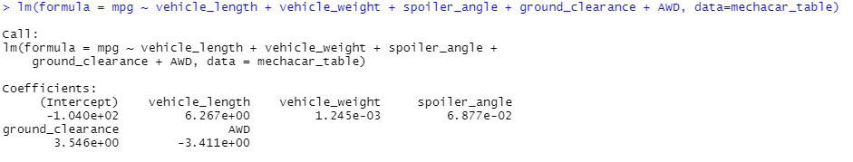
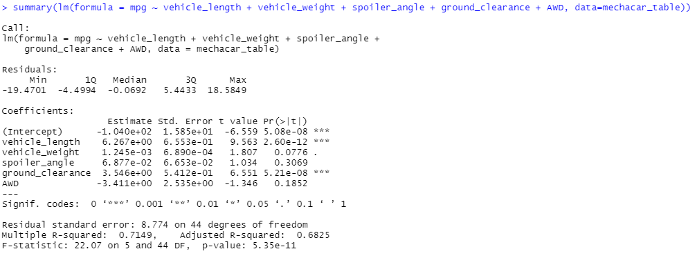

# MechaCar_Statistical_Analysis

## Linear Regression to Predict

  - Linear Regression coefficients:
  
  
  - Linear Regression Summary
  
  
  
  - Which variables/coefficients provided a non-random amount of variance to the mpg values in the dataset?
    - Intercept, vehicle_length, and ground_clearance provide significance variance to the mpg values in the dataset. 
	- Also vehicle_weight might provide some significance.
	
  - Is the slope of the linear model considered to be zero? Why or why not?
    - Slope is not considered zero. Since null hypothesis h0 is rejected.
	- Null hypothesis is rejected because of 3 variables showing significance variance to mpg values in the dataset.
	
  - Does this linear model predict mpg of MechaCar prototypes effectively? Why or why not?
    - This model shows that Intercept is very significant, so it will not predict mpg effectively.
	- This model tells us there might be variables that are not in our dataset that need to be collected and observed.