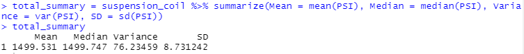
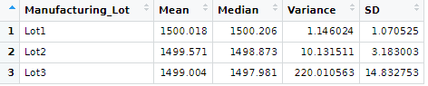

# MechaCar_Statistical_Analysis

## Overview
Statistical analysis of the MechaCar dataset is done using multiple linear regression to identify the variables in the dataset that predict the mpg of MechaCar prototypes.

Data analytics will be done on the following:
  - Perform multiple linear regression analysis to identify which variables in the dataset predict the mpg of MechaCar prototypes
  - Collect summary statistics on the pounds per square inch (PSI) of the suspension coils from the manufacturing lots
  - Run t-tests to determine if the manufacturing lots are statistically different from the mean population
  - Design a statistical study to compare vehicle performance of the MechaCar vehicles against vehicles from other manufacturers. 
  
A summary interpretation of the findings for each statistical analysis is shown below.

## Resources
Data: MechaCar_mpg.csv, Suspension_Coil.csv
Software: R 

## Testing Hypotheses
  linear regression tests the following hypotheses:
   - H0 : The slope of the linear model is zero, or m = 0
   - Ha : The slope of the linear model is not zero, or m ≠ 0

## Linear Regression to Predict

  - Linear Regression coefficients:
  
  
  - Linear Regression Summary
  
  
  
  - Which variables/coefficients provided a non-random amount of variance to the mpg values in the dataset?
    - Intercept, vehicle_length, and ground_clearance provide significance variance to the mpg values in the dataset. 
    - Also vehicle_weight might provide some significance.
	
  - Is the slope of the linear model considered to be zero? Why or why not?
    - Slope is not considered zero. Since null hypothesis H0 is rejected.
    - Null hypothesis is rejected because of 3 variables showing significance variance to mpg values in the dataset.
	
  - Does this linear model predict mpg of MechaCar prototypes effectively? Why or why not?
    - This model shows that Intercept is very significant, so it will not predict mpg effectively.
    - This model tells us there might be variables that are not in our dataset that need to be collected and observed.

## Summary Statistics on Suspension
The design specifications for the MechaCar suspension coils dictate that the variance of the suspension coils must not exceed 100 pounds per square inch. 

Does the current manufacturing data meet this design specification for all manufacturing lots in total and each lot individually? Why or why not?

  - Based on the analysis on the current data on suspension coils we see that the overall design specifications are met as the variance of PSI is 76.23459, which is less than the 100.
    - 
    
    
  - However variance by lots show that lot 1 and lot 2 are well within the limit and lot 3 is not.
    - 
    
    
